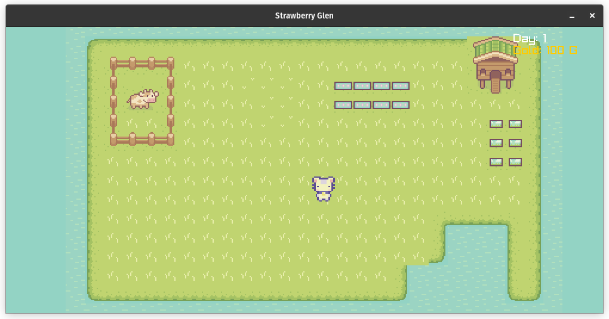

# 🍓 Strawberry Glen

A whimsical 2D farm-bakery simulator where you inherit a magical farm, grow enchanted strawberries, bake quirky recipes, and unravel doughy mysteries. Earn coins, befriend moody cows, and win the Grand Glen Bake-Off!



---

## 🌟 Features

- **Farming & Crafting**: Plant seeds, harvest crops, and bake magical goods like _Strawberry Milk Cake_ and _Experimental Jam_.
- **Cow Companions**: Manage cows with unique personalities—grumpy Moozart loves jazz, while Cowculus philosophizes in the rain.
- **Dynamic Shop**: Buy/sell items, upgrade your store, and attract ghost customers with _Ghost Acceptance™_ upgrades.
- **Inventory System**: Manage tools, seeds, and baked goods across 5 slots. Reusable tools and stackable items supported!
- **Quests & Secrets**: Collect _Eldermint Leaves_ and craft the _Cow Flute_ to calm angry cows and uncover hidden lore.
- **Whimsical Tone**: Burnt pies, sentient strawberries, and a mushroom syndicate debt—charm meets chaos!

---

## 🛠️ Installation

### 1. **Prerequisites**

Make sure the following are installed on your system:

- **[Go](https://golang.org/dl/)** (version 1.16 or higher)
- **[Raylib](https://www.raylib.com/)** (C library)
- **[raylib-go](https://github.com/gen2brain/raylib-go)** bindings for Go

#### OS-specific Notes:

- **Linux (Ubuntu/Debian)**:

  ```
  sudo apt install build-essential libgl1-mesa-dev libopenal-dev libxcursor-dev libxi-dev libxrandr-dev libxinerama-dev libxxf86vm-dev libx11-dev
  go get github.com/gen2brain/raylib-go/raylib
  ```

- **macOS** (with Homebrew):

  ```
  brew install raylib
  go get github.com/gen2brain/raylib-go/raylib
  ```

- **Windows**:

  - Install [MSYS2](https://www.msys2.org/) and run:

    ```
    pacman -S mingw-w64-x86_64-gcc
    ```

  - Add Raylib: [Download precompiled binaries](https://github.com/raysan5/raylib/releases)
  - Add `raylib` to your system `PATH`, and then run:

    ```
    go get github.com/gen2brain/raylib-go/raylib
    ```

### 2. **Run the Game**

Clone the repository and run the game:

```
git clone https://github.com/yourusername/strawberry-glen.git
cd strawberry-glen
go run .
```

---

## 🥧 How to Play

1. **Farming**:
   - Collect seeds (e.g., `Wheat Seeds`).
   - Plant, water, and harvest crops over 3 days.
2. **Baking**:

   - Combine ingredients (e.g., `Strawberry + Milk + Wheat`) at the oven.
   - Sell baked goods in your shop for coins!

3. **Cow Care**:

   - Feed cows daily to collect milk.
   - Use the _Cow Flute_ to calm grumpy cows.

4. **Shop Management**:

   - Buy low, sell high! Restock occurs every 5 minutes.
   - Unlock upgrades like _Loyalty Cards_ and _Ghost Acceptance™_.

5. **Quests**:
   - Complete tasks (e.g., gather _Eldermint Leaves_) to progress the story.

---

## 🎮 Master the Keys - Control Cheat Sheet

**Core Movement**  
⮕ `WASD/Arrow Keys` - Move character  
⮕ `E` - Interact with crops/animals/objects

**Inventory & Crafting**  
🎒 `I` - Toggle inventory  
🔢 `1-6` - Quick-select inventory slots  
🔄 `TAB` - Switch between shop modes (Buy/Sell/Bake)  
🗑️ `ALT+1-6` - Remove ingredients while baking

**Farming Actions**  
🌾 `4 (Hoe)` - Till soil (assign to inventory slot)  
💧 `3 (Watering Can)` - Water crops  
🐄 `6 (Milking Bucket)` - Milk cows

**Bakery Special**  
👨🍳 `TAB` - Switch between buying and baking modes  
✅ `ENTER` - Confirm recipe selection  
🔀 `Arrow Keys` - Navigate bakery recipes

**System Controls**  
⏸️ `ESC` - Pause game/open menu  
🖥️ `F11` - Toggle fullscreen  
🔍 `Z/X` - Zoom in/out

---

## 📦 Your Pocket Universe - Item System Explained

### 🛠️ Tools (Reusable forever!)

⚒️ **Watering Can (ID:3)** - Hydrate crops daily  
⚒️ **Hoe (ID:4)** - Till soil for planting  
⚒️ **Axe (ID:5)** - Clear obstacles

### 🌱 Seeds (Plant in tilled soil)

🌾 **Wheat Seeds (ID:1)** - Grows in 3 days  
🌾 **Strawberry Seeds (ID:2)** - Sweet profits!

### 🍓 Crops (Harvest to bake/sell)

🧺 **Wheat (ID:10)** - Base for bread  
🧺 **Strawberry (ID:11)** - For tarts and cakes

### 🥧 Baked Goods (Sell for $$$)

🧁 **Bread (ID:30)** - Basic but reliable  
🧁 **Strawberry Tart (ID:31)** - Customer favorite  
🧁 **Burnt Pie (ID:33)** - Oops! Still sells to Glump the Ogre

### 🐄 Special Items (Unlock secrets!)

🍃 **Eldermint Leaves (ID:40)** - Quest item for Berry's tea

---

## 🐔 Expanded Animal Care

- **Chicken Coop**: Collect eggs every 2 minutes using `B` near coop
- **Cow Milking**: Milk cows every 2 minutes with milking bucket

---

## 🌟 New Progression Features 

- Unlock Large Backpack after 7 days (+2 slots)
- Earn Fertilizer upgrade after 20 harvests (+25% growth)
- Discover Eldermint Seeds at 5000G for special recipes

---

## 🖥️ Technical Details

- **Engine**: Built with Go and Raylib for 2D rendering.
- **Code Structure**:
  - `main.go`: Core gameplay loop, rendering, and input handling.
  - `inventory.go`: Inventory management and UI.
  - `shop.go`: Buy/sell logic and shop interface.
- **Assets**: Textures for items, tiles, and characters in `assets/`.

---

## 🙌 Credits

- **Assets**: [Sprout Lands -By : Cup Nooble](https://cupnooble.itch.io/sprout-lands-asset-pack)
- **Music**:
- **Inspiration**: Stardew Valley + Animal Crossing

---

## 📜 License

MIT License. See [LICENSE](LICENSE) for details.
